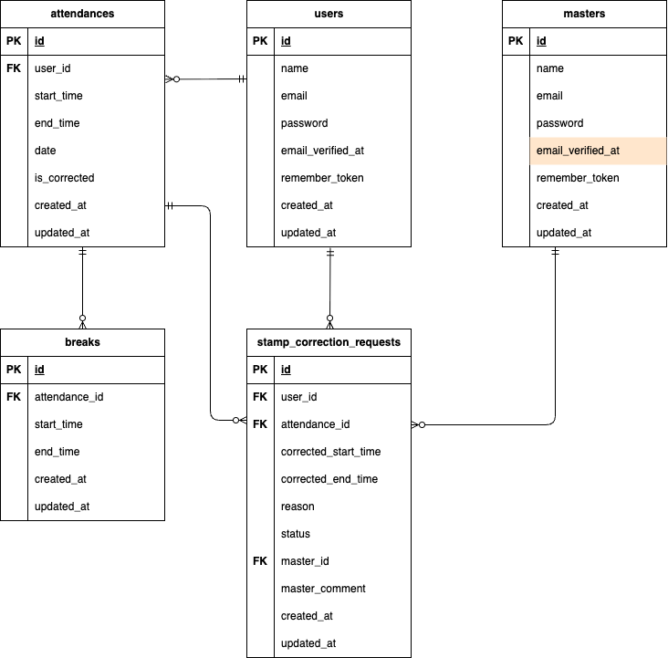

# 勤怠管理アプリ

## プロジェクトの概要
    coachtechフリマ は、ある企業が開発した独自の勤怠管理アプリです。社会人全般を主なターゲットに、ユーザーの勤怠と管理を目的としています。初年度ユーザー数1,000人の達成を目標に、設計・コーディング・テストまでを一貫して担当します。

    (本プロジェクトは、Laravelを用いたWebアプリケーション開発の模擬案件として取り組んでおり、一人で設計から実装、テストまでを行い、実務に近い開発プロセスの体験を目的としています。)

## 環境構築手順


 (メモ：makefileでショートカット作ってみる！)
**Dockerビルド**
1. GitHubからプロジェクトをクローン ※SSH接続でクローンする場合は、事前にGitHubにSSH鍵を登録しておいてください。
```bash
    git clone git@github.com:S185900/coachtech-attendance.git
```
2. プロジェクトディレクトリに移動
```bash
    cd coachtech-attendance
```
3. (初回のみ)MySQL用の空ディレクトリを作成 ※Dockerビルドの際のエラー回避のため
```bash
    mkdir -p docker/mysql/data
```
4. DockerDesktopアプリを立ち上げる
5. Dockerコンテナをビルド＆起動
```bash
    docker-compose up -d --build
```

> *MacのM1・M2チップのPCの場合、`no matching manifest for linux/arm64/v8 in the manifest list entries`のメッセージが表示されビルドができないことがあります。エラーが発生する場合は、docker-compose.ymlファイルの「mysql」内に「platform」の項目を追加で記載してください*

``` bash
mysql:
    platform: linux/x86_64 # ← この行を追加
    image: mysql:8.0.26
    environment:
```

**Laravel環境構築**
1. PHPコンテナに入る
```bash
    docker-compose exec php bash
```

2. Laravelパッケージをインストール
```bash
    composer install
```

> *composer install 実行時に表示されるパッケージに関する注意について：　このプロジェクトでは、fruitcake/laravel-cors および swiftmailer/swiftmailer のパッケージを使用しています。composer install 実行時に、これらが非推奨（abandoned）である旨のメッセージが表示されますが、現時点では動作に問題はありません。今後のLaravelのバージョンアップやセキュリティ対応を見据えて、必要に応じて代替手段への移行を検討することも可能です。*

3. .env.example をコピーして .env を作成。または、新しく.envファイルを作成。
```bash
cd coachtech-attendance
cd src
cp .env.example .env
```

4. .env に以下の環境変数を追加(一部、記載があるか確認も行う)
``` text
# DB設定
DB_CONNECTION=mysql
DB_HOST=mysql
DB_PORT=3306
DB_DATABASE=laravel_db
DB_USERNAME=laravel_user
DB_PASSWORD=laravel_pass

# Fortify（セッションドライバ）があるかどうか確認を行う
SESSION_DRIVER=file

# Mailhog（ローカルメール送信）※メール受信画面については後ほど詳しく紹介しています
MAIL_MAILER=smtp
MAIL_HOST=mailhog
MAIL_PORT=1025
MAIL_USERNAME=null
MAIL_PASSWORD=null
MAIL_ENCRYPTION=null
MAIL_FROM_ADDRESS=no-reply@example.test # Mailhog用の仮アドレス
MAIL_FROM_NAME="${APP_NAME}"

# Stripe（テスト用APIキー）※キーの取得方法は後ほど詳しく紹介しています
STRIPE_KEY=(あなたの公開キー)
STRIPE_SECRET=(あなたの秘密キー)
```
> *Mailhog（メール送信確認）について：Mailhogは、ローカル環境でメール送信を確認するためのツールです。 アカウント登録などは不要で、Docker起動時に自動で立ち上がります。ブラウザで http://localhost:8025 にアクセスします。Laravelから送信されたメール（認証・パスワードリセットなど）が一覧表示されます。*

> *Stripe（テスト用APIキー）について：このプロジェクトでは、Stripeを使ったクレジットカード決済機能とコンビニ決済機能を実装しています。APIキーは各自のStripeアカウントで取得してください。[Stripe公式サイト](https://dashboard.stripe.com/register)でアカウントを作成（無料）し、テスト用APIキーを取得してください。*

5. アプリケーションキーの作成
``` bash
php artisan key:generate
```

6. キャッシュクリア
``` bash
php artisan config:clear
php artisan cache:clear
```

7. シンボリックリンク作成
``` bash
php artisan storage:link
```

8. マイグレーションの実行
``` bash
php artisan migrate
```

9. シーディングの実行
``` bash
php artisan db:seed --class=UserSeeder
php artisan db:seed --class=CategorySeeder
php artisan db:seed --class=BrandSeeder
php artisan db:seed --class=CustomProductSeeder
```

## 使用技術
- PHP 8.1
- Laravel ^8.75（実際のバージョンは composer.lock に依存）
- MySQL 8.0.26
- Laravel Fortify（ユーザー認証）
- Stripe（テスト決済）
- Mailhog（メール送信確認）
- Docker / Docker Compose

## ダミーユーザーのログイン情報
| ユーザー種別     | メールアドレス         | パスワード     |
|------------------|--------------------------|----------------|
| 一般ユーザー | user@gmail.com | password123    |
| 管理者ユーザー | admin@gmail.com | password123    |
| ダミーユーザー（10名） | Factoryで自動生成されたメールアドレス | password123    |


> *指定された商品データを登録するにあたり、**出品者としてのダミーユーザーを事前に登録しています**。(登録フォームから作成されたユーザーは、入力したパスワードでログインしてください)*

## ER図


## URL
- 開発環境：http://localhost/
- phpMyAdmin:：http://localhost:8080/
- Mailhog： http://localhost:8025/

## 基本設計書(スプレッドシート)


## テーブル仕様書(スプレッドシート)


## 補足

**✅ メール認証誘導画面**
- このアプリでは、ユーザーのメールアドレス認証を行うための導線を以下のように設計しています。
- 開発環境では、メール確認用に MailHog を使用しています。
```text
<実装した導線>
1. メール認証導線画面を表示する
2. 「認証はこちらから」ボタンを押下
3. メール認証サイト（MailHog）を表示する
4. MailHogで直近に届いたメールを開き、「Verify Email Address」ボタンをクリック
5. プロフィール設定画面（初回）が別タブで開く
```
*補足： メール認証サイト（MailHog）を別タブで開く理由*
- 要件「3. メール認証サイトを表示する」に対応する形で、開発中の操作性と確認のしやすさを考慮し、MailHogを別タブで表示する設計としています。これにより、ユーザーは元のアプリ画面を保持したまま、メール内容の確認や認証リンクのクリック、メールの再送などを行うことができ、画面遷移による混乱を避けることができます。

*補足： プロフィール設定画面（初回）を別タブで開く理由*
- 認証メール内のリンクをクリックすると、プロフィール設定画面（初回）が新しいタブで開くようになっています。これは、MailHogの画面を保持したまま、認証後の遷移先を確認できるようにするためです。開発中のデバッグや動作確認をスムーズに行えるよう配慮した設計です。

*補足： ※MailHogは開発環境専用のツールです。本番環境では、実際のメール配信サービスを通じて、ユーザーのメールクライアントで認証リンクを開く想定です。*

```text
<要件より抜粋>
1. メール認証導線画面を表示する
2. 「認証はこちらから」ボタンを押下
3. メール認証サイトを表示する

初回会員登録直後、プロフィール設定画面に遷移すること
```

**✅ メール認証誘導画面**
- 本アプリでは、以下の要件を同時に満たすために、「購入する」ボタン押下時にStripeの決済画面を別タブで表示する仕様としています。

*補足： 仕様の意図*
- 「購入する」ボタンを押すと、Stripeの決済画面が別タブで開かれ、同時に元のタブでは商品一覧画面へのリダイレクトが実行されます。これにより、「決済画面への遷移（応用要件）」と「商品一覧への遷移（通常要件）」の両立を実現しています。
```text
<要件より抜粋>
    通常要件：「購入する」ボタンを押下すると購入が完了するか
            　商品を購入した後の遷移先は商品一覧画面になっているか
    応用要件：「購入する」ボタンを押下した際にstripeの決済画面に接続される
```

**✅ PHPUnitによるテストについて**
- テスト実行コード一覧
``` bash
#1 認証機能（一般ユーザー）
php artisan test tests/Feature/UserRegistrationTest.php

#2 ログイン認証機能（一般ユーザー）
php artisan test tests/Feature/UserLoginTest.php

#3 ログイン認証機能（管理者）
php artisan test tests/Feature/AdminLoginTest.php

#4 日時取得機能
php artisan test tests/Feature/AttendanceDateTimeTest.php

#5 ステータス確認機能
php artisan test tests/Feature/AttendanceStatusTest.php

php artisan test tests/Feature/AttendancePostTest.php

php artisan test tests/Feature/RestTest.php

php artisan test tests/Feature/ClockOutTest.php

php artisan test tests/Feature/AttendanceListTest.php

php artisan test tests/Feature/AttendanceDetailTest.php

php artisan test tests/Feature/AttendanceCorrectionTest.php

php artisan test tests/Feature/AdminAttendanceListTest.php

php artisan test tests/Feature/AdminAttendanceDetailTest.php

php artisan test tests/Feature/AdminStampCorrectionTest.php

php artisan test tests/Feature/EmailVerificationTest.php
```
